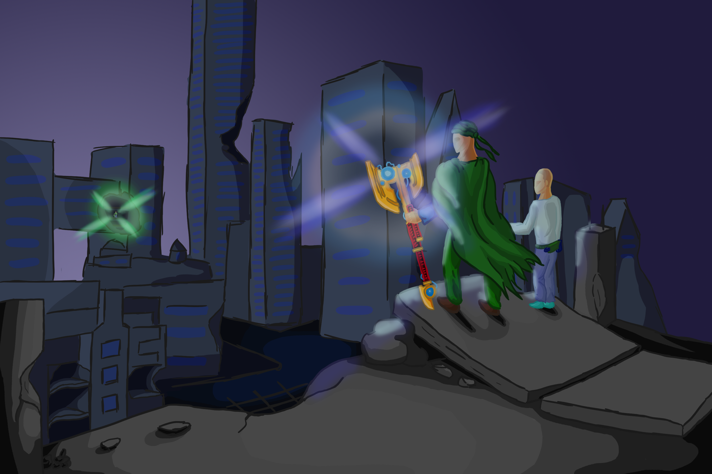
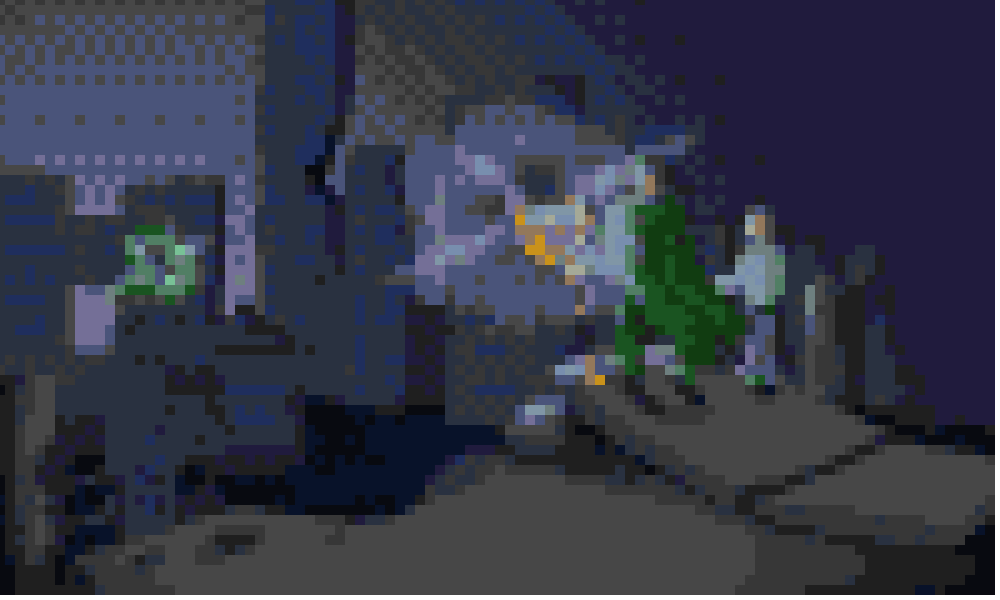
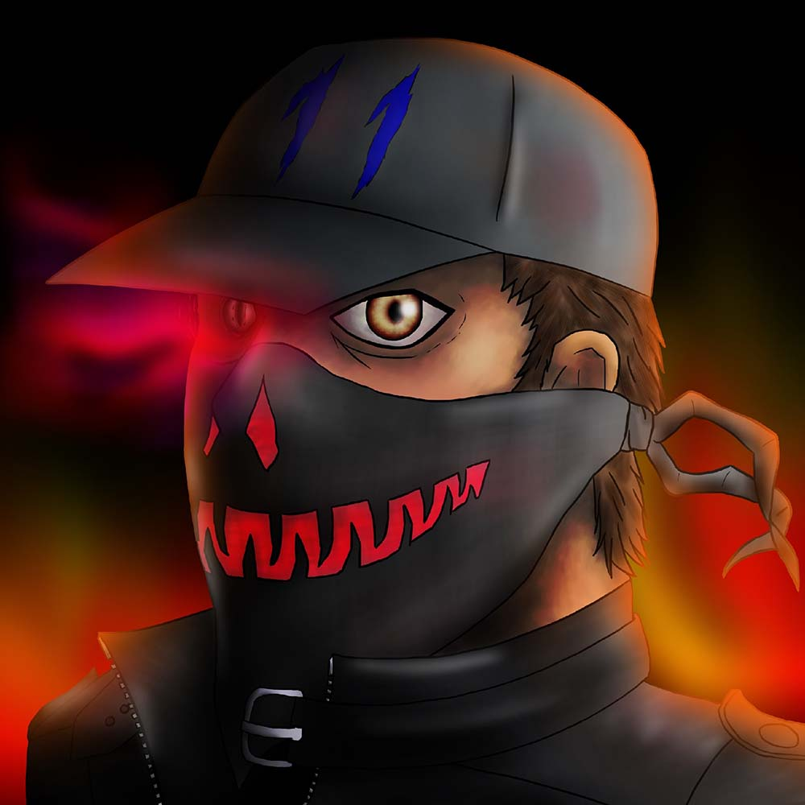
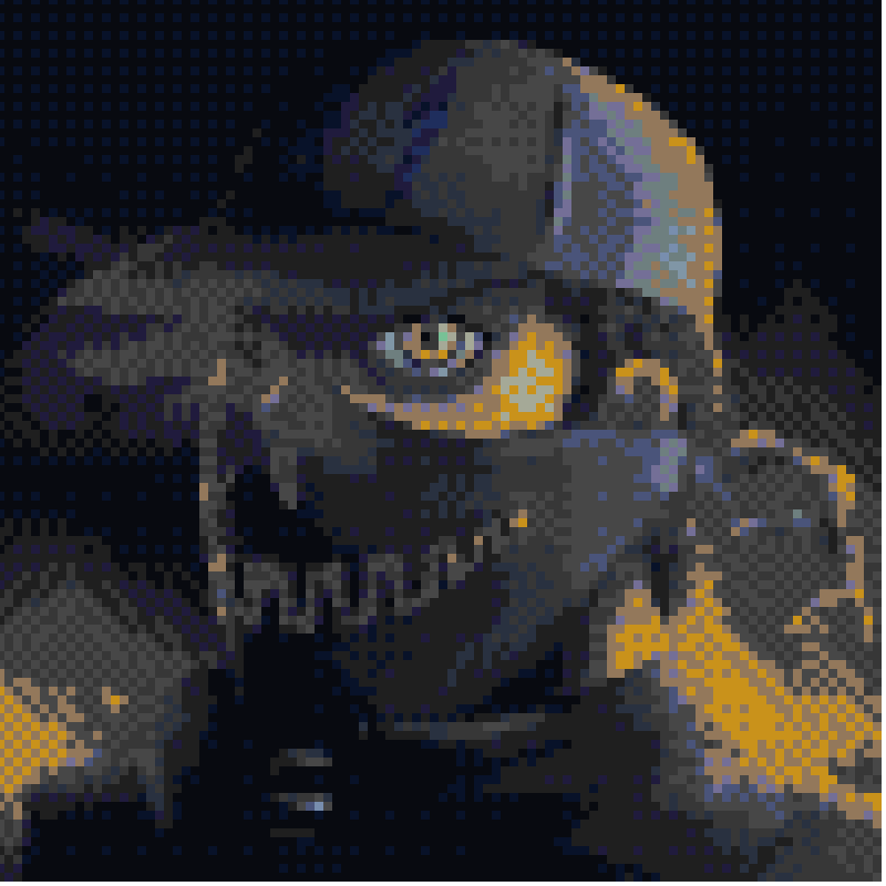
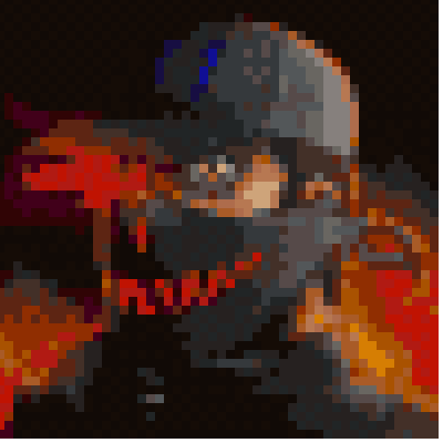

# Pixelator

A small program that automatically convert a high definition image into a pixelated one

# Controls

* load -> load an image from your files
* slider -> the upper slider controles how many collors the auto pallete creator should find; Preatty slow on a large number of colors
* save -> 3 options
    * save image : save the pixelated image
    * save large : save a larger version of the pixelated image without interpolation betwin pixels
    * save pallete : save an image with the selected pallete
* interpolation -> the interpolation method used in dowscalling the original image; my personal recomandation is eather "low" or "nearest neighbor"
* color distance -> the method used for finding the closest color; it is used in the creation of the pallet and in the finding the color from the pallete
* show all colors -> this option is used to show the downscaled version without shoosing the colors from the pallete
* size box -> the text box where the size of the final image can be selected
* add color -> a color dialoge for adding a new color to the pallete
* transform -> for the creations of the finale image that is affected by all the above options
* not buttons related -> there are auxiliar options for adding or remouving colors from the pallete; those options work on the 3 images: the original, the finale and the pallete
    * left click -> add the selected color
    * right click -> remove the closesc color

# Some resoults

those are images fresh out of the app

Original (be gentle, it's an extreamly old drawing)

200x120

100x60

Original

100x100

100x100 pallete swap

50x50

Have fun!